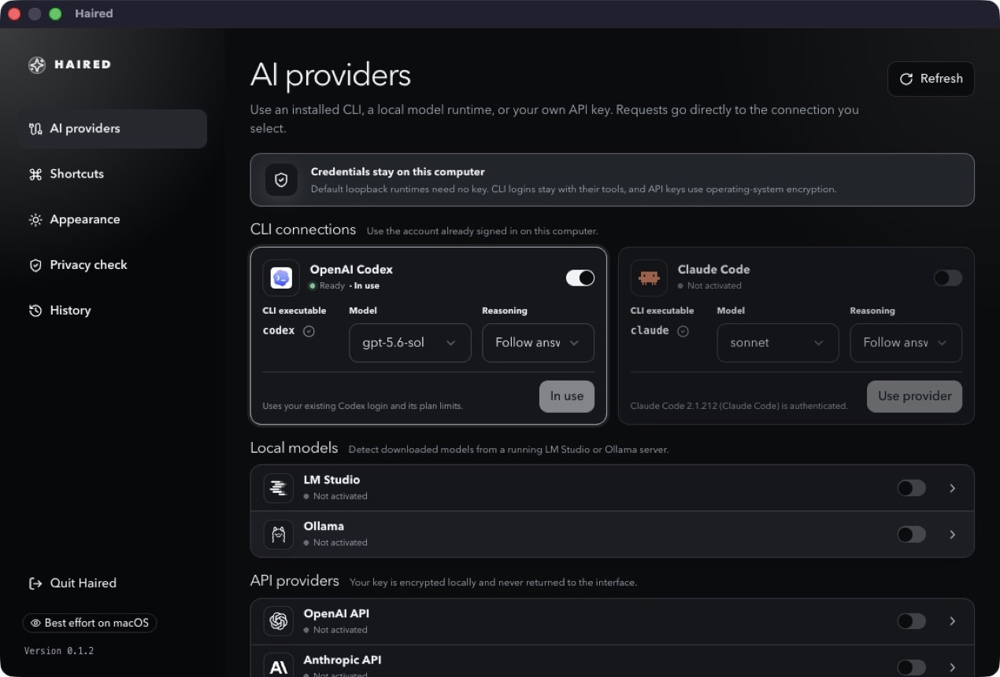
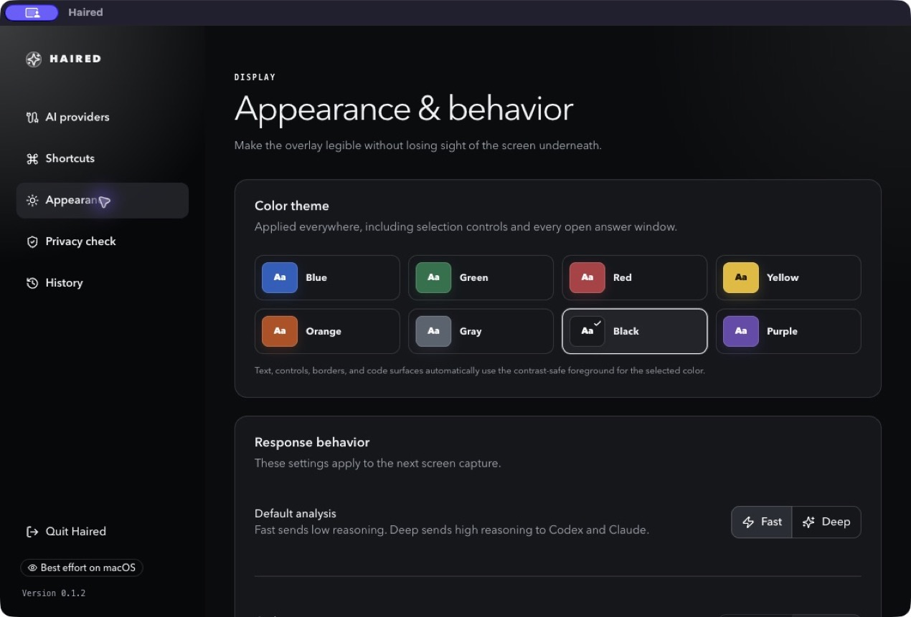
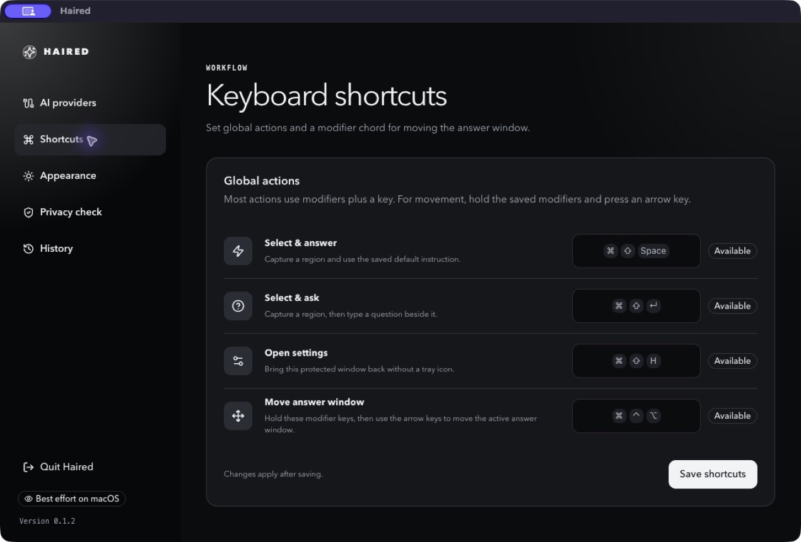
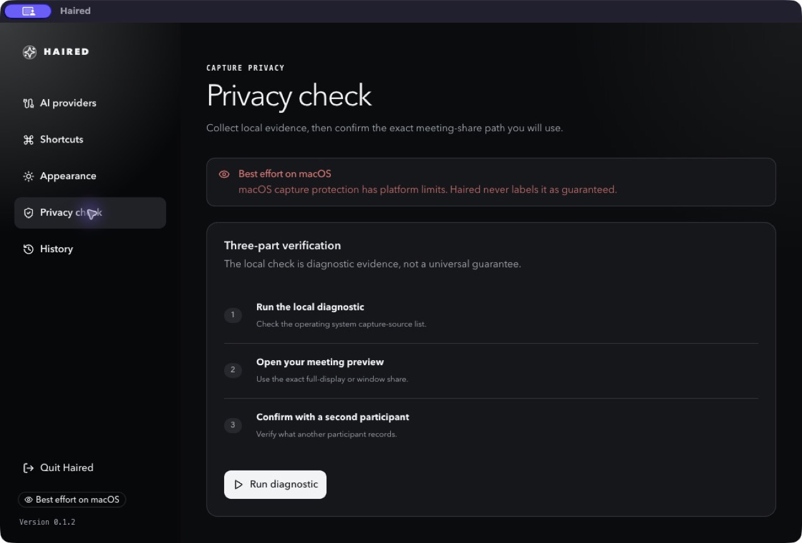

# Haired

A free, open-source **stealth pair-programming and interview AI assistant** for macOS and Windows.

  

  <a href="https://github.com/rsm23/haired/releases/latest">Download</a> ·
  <a href="https://rsm23.github.io/haired/">Website</a> ·
  <a href="#features">Features</a> ·
  <a href="#providers">Providers</a>

## What is Haired?

Haired sits quietly on your desktop until you need it. Select any permitted
screen region and get a streamed coding answer in an always-on-top overlay—no
context switching, no browser tab, no account required.

- **Stealth pair programming** — ask about code, errors, tests, or diagrams without leaving your editor.
- **Interview Mode** — structured reasoning, plan, complete code, trade-offs, edge cases, complexity, and validation.
- **Fast / Deep reasoning** — concise fixes or thorough step-by-step analysis.
- **Your models, your keys** — local LM Studio / Ollama, an existing Codex or Claude CLI login, or your own provider API key.
- **Encrypted local history** — screenshots, prompts, and answers stay encrypted on your machine.
- **Screen-share aware** — on supported Windows capture paths, Haired asks the OS to exclude its windows from Microsoft Teams, Zoom, and Google Meet shares.

> [!IMPORTANT]
> Use Haired only for content you are permitted to capture and send to your
> chosen provider. Screen-share protection is platform-dependent; always verify
> the live meeting preview before sharing sensitive content.

## Features

### Connect your own providers

No Haired account, no hosted proxy, no usage credits. Pick the model you already have.

  

### Customize the overlay

Themes, opacity, fonts, shortcuts, magnifier, and launch-at-login—tune the overlay so it fits your workflow.

  

### Keyboard-first

Global shortcuts for capture, ask, settings, and moving answer windows. Record your own in the app.

  

### Privacy check

See your platform's capture-protection status and run a local diagnostic before you share your screen.

  

## Providers

| Kind | Providers |
|---|---|
| Local CLI (reuse existing login) | OpenAI Codex CLI, Claude Code CLI |
| Local runtime | LM Studio, Ollama |
| Bring-your-own-key | OpenAI, Anthropic, Google Gemini, Mistral, OpenAI-compatible |

API keys are encrypted with the OS secure storage (macOS Keychain / Windows DPAPI) and never returned to the renderer. Local models run on your machine; requests to BYOK providers go directly from the app to the provider.

## Quick start

1. **Install Haired** from the [latest release](https://github.com/rsm23/haired/releases/latest).
2. **Pick a provider** in Settings → AI providers:
   - Run `codex login` or `claude auth login` for CLI providers.
   - Start LM Studio's local server or `ollama serve` for local models.
   - Or paste an API key for OpenAI, Anthropic, Gemini, Mistral, or a compatible endpoint.
3. **Select a screen region** with `Cmd/Ctrl+Shift+Space` (answer) or `Cmd/Ctrl+Shift+Enter` (ask).
4. **Read the answer** in the overlay, copy code, ask follow-ups, or save it to encrypted history.

| Action | Default shortcut |
|---|---|
| Select & answer | `Cmd/Ctrl+Shift+Space` |
| Select & ask | `Cmd/Ctrl+Shift+Enter` |
| Open settings | `Cmd/Ctrl+Shift+H` |
| Move answer window | Hold `Cmd/Ctrl+Alt` + arrow keys |

> Preview builds are unsigned: Windows SmartScreen and macOS Gatekeeper may show a warning. Verify the SHA-256 checksums on the release page before installing.

## License

MIT — see [LICENSE](LICENSE).
