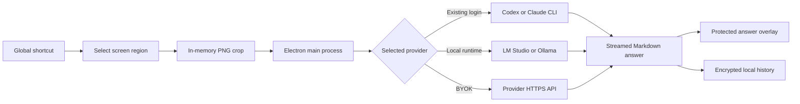

# Haired

Haired is a free, keyboard-first screen assistant for Windows and macOS. Select
a region of the screen, ask a question (or use a saved instruction), and read a
streamed AI answer in an always-on-top overlay without leaving the application
you are using.

Haired connects to downloaded local models through LM Studio or Ollama, an
existing OpenAI Codex or Claude Code CLI login, or directly to an AI provider
with an API key that you supply. It has no Haired account, hosted AI proxy,
license key, paid plan, or usage-credit system.

## Microsoft Teams, Zoom, and Google Meet screen sharing

**You see Haired on your desktop. On supported Windows capture paths, the
meeting receives the underlying screen without the Haired window.** Haired asks
Windows to exclude every settings, selection, and answer window from capture
before that window is shown. This is designed for the screen-sharing paths used
by **Microsoft Teams, Zoom, and Google Meet** on Windows 10/11.

| Platform | What to expect during screen sharing |
|---|---|
| Windows 10 22H2 / Windows 11 | Haired windows are designed not to appear in supported Microsoft Teams, Zoom, and Google Meet full-display or window shares. |
| macOS 13+ | Best effort only. Current ScreenCaptureKit paths can ignore AppKit sharing protection, so Haired may remain visible. |

Always open the meeting application's real share preview and verify the exact
full-display or window-sharing mode before sharing sensitive content. Meeting
apps, operating systems, and capture implementations can change independently
of Haired.

> [!IMPORTANT]
> Haired is intended for content that you are permitted to capture and send to
> the provider you select. Capture protection is platform-dependent and is not
> a guarantee against every screen-sharing, recording, or capture method.

## Contents

- [Microsoft Teams, Zoom, and Google Meet screen sharing](#microsoft-teams-zoom-and-google-meet-screen-sharing)
- [What the app does](#what-the-app-does)
- [How it works](#how-it-works)
- [Providers](#providers)
- [Supported platforms](#supported-platforms)
- [Keyboard workflow](#keyboard-workflow)
- [Settings and product surfaces](#settings-and-product-surfaces)
- [Privacy and security](#privacy-and-security)
- [Repository structure](#repository-structure)
- [Local desktop development](#local-desktop-development)
- [Preview the GitHub Pages site locally](#preview-the-github-pages-site-locally)
- [Publish the site with GitHub Pages](#publish-the-site-with-github-pages)
- [Configuration](#configuration)
- [Testing and builds](#testing-and-builds)
- [Desktop releases and updates](#desktop-releases-and-updates)
- [Troubleshooting](#troubleshooting)

## What the app does

- Captures a user-selected screen region and processes the crop in memory.
- Offers two capture flows: **Select & answer** and **Select & ask**.
- Streams Markdown answers, including syntax-highlighted fenced code blocks.
- Solves visible programming tasks instead of merely summarizing them.
- Offers **Fast** and **Deep** reasoning modes.
- Can display only complete code blocks or the provider's full reply.
- Supports follow-up questions using the current answer as conversation context.
- Lets you copy, export, pin, close, and move answer windows.
- Keeps a searchable, encrypted local history with optional automatic deletion.
- Provides configurable global shortcuts, themes, overlay opacity, and an
  opt-in answer magnifier.
- Starts quietly at login when enabled and remains available through shortcuts
  when its settings window is hidden.
- Downloads signed application updates in production and installs them after
  confirmation or when the app quits.

## How it works



The renderer never receives raw BYOK secrets. Electron's sandboxed preload
bridge exposes a narrow IPC API, and the main process validates IPC senders and
shared request schemas before performing capture, provider, history, clipboard,
or filesystem operations.

There is intentionally no Haired API service or payment stack. Requests travel
from the desktop main process directly to the selected CLI, local runtime, or
provider API.

## Providers

Haired supports two local model runtimes, two local CLI connections, and five
bring-your-own-key (BYOK) connections:

| Provider | Connection | Authentication | Default model/configuration |
|---|---|---|---|
| OpenAI Codex | `codex app-server` | Existing `codex login` | Provider default; editable model and reasoning effort |
| Claude Code | Non-interactive `claude` stream JSON | Existing `claude auth login` | `sonnet`; editable model and reasoning effort |
| LM Studio | Local OpenAI-compatible Chat Completions API | None by default | Live discovery from `GET /v1/models`; default endpoint `http://127.0.0.1:1234/v1` |
| Ollama | Native local Chat API | None on the local API | Live discovery from `GET /api/tags`; default endpoint `http://127.0.0.1:11434` |
| OpenAI | Responses API | Locally saved API key | `gpt-5.6-terra` |
| Anthropic | Messages API | Locally saved API key | `claude-sonnet-4-6` |
| Google Gemini | `streamGenerateContent` | Locally saved API key | `gemini-3.5-flash` |
| Mistral AI | Chat Completions API with vision | Locally saved API key | `mistral-small-latest` |
| OpenAI-compatible | Chat Completions API | Locally saved key plus editable endpoint/model | OpenRouter-compatible defaults |

Every provider has an explicit activation switch. Only a provider that is
enabled, configured, authenticated, and ready can be selected.

When LM Studio or Ollama is active, **Refresh** and **Detect models** query the
running server and replace the model dropdown with the models currently
reported as available/downloaded. A removed model is no longer offered and the
runtime is marked not ready until another model is selected. Because Haired
sends a screenshot with every analysis request, select a model with vision/image
input support; a text-only model will reject or ignore the crop.

CLI providers reuse their own login files. BYOK secrets are encrypted with
Electron `safeStorage` (macOS Keychain or Windows DPAPI), are never displayed
again after saving, and are never returned to the renderer.

Provider subscriptions, API charges, rate limits, model access, and provider
acceptable-use rules remain the user's responsibility.

## Supported platforms

| Platform | Supported release target | Capture-protection status |
|---|---|---|
| Windows 10 22H2 / Windows 11 x64 | Yes | Protected top-level windows are excluded from supported Microsoft Teams, Zoom, Google Meet, and other Windows capture paths on Windows 10 2004+ |
| macOS 13+ Intel | Yes | Best effort; verify the exact sharing path before relying on it |
| macOS 13+ Apple Silicon | Yes | Best effort; verify the exact sharing path before relying on it |
| Linux | No | Not a release target |

Haired uses a single application instance. It has no tray icon, menu-bar item,
application menu, Dock presence on macOS, or taskbar presence for its windows by
default. Reopen the executable or use the settings shortcut to bring settings
back.

## Keyboard workflow

The default global shortcuts are:

| Action | Default shortcut | Behavior |
|---|---|---|
| Select & answer | `CommandOrControl+Shift+Space` | Select a region and run the saved default instruction |
| Select & ask | `CommandOrControl+Shift+Enter` | Select a region, then type a question |
| Open settings | `CommandOrControl+Shift+H` | Show the protected settings window |
| Move answer window | Hold `CommandOrControl+Alt`, then use arrow keys | Move the active answer overlay in 24 px steps; held arrows repeat |

`CommandOrControl` means Command on macOS and Control on Windows. Shortcut
recording keeps macOS Control (`⌃`) distinct from Command (`⌘`). Conflicting or
unavailable shortcuts are reported in Settings.

The normal workflow is:

1. Configure and select a ready provider under **AI providers**.
2. Press **Select & answer** or **Select & ask**.
3. Drag over a screen region (minimum 8 × 8 pixels).
4. In ask mode, type the question and choose Fast or Deep.
5. Read the streamed answer in the overlay.
6. Optionally ask a follow-up, switch between Code only and Full reply, copy or
   export the Markdown, pin the answer, or move it with the movement shortcut.

Up to three answers can be pinned. Unpinned overlays are closed when a new
capture begins.

## Settings and product surfaces

The desktop settings UI contains five sections:

### AI providers

- Detect, configure, activate, and select Codex and Claude CLI installations.
- Select a CLI model and automatic or explicit reasoning effort.
- Detect downloaded LM Studio and Ollama models from their local servers.
- Select a discovered vision-capable local model; removed models invalidate the
  previous selection on refresh.
- Configure, activate, and select BYOK providers.
- Edit an OpenAI-compatible base URL and model.
- Save, replace, or clear encrypted API keys.

### Shortcuts

- Record all global actions.
- Record modifier-only answer movement chords.
- Detect duplicate, invalid, and operating-system-reserved shortcuts.

### Appearance & behavior

- Eight persistent, contrast-aware themes: blue, green, red, yellow, orange,
  gray, black, and purple. Black is the fresh-install default.
- Fast or Deep default analysis.
- Code only or Full reply default for programming answers.
- Overlay opacity from 62% to 98% (88% by default).
- Optional 176 px, 1.85× magnifying-glass cursor over answer content.
- Optional launch at login.
- Editable Select & answer instruction, up to 4,000 characters.
- History retention: forever, 30 days, 90 days, or one year.

### Privacy check

- Shows the platform-specific protection status.
- Runs a local capture-source diagnostic.
- Links to macOS screen-recording permission settings when required.
- Reminds the user to verify the actual meeting preview and confirm with a
  second participant.

### History

- Searches up to the 500 most recent saved answers.
- Shows the encrypted screenshot thumbnail, prompt, answer, provider, model,
  mode, and response style after local decryption.
- Supports Code only / Full reply switching, rerun, Markdown export, individual
  deletion, and complete history clearing.
- Warns when encrypted history exceeds a 5 GB soft limit.

The static web app contains product, provider, privacy, terms, help, and setup
content. It uses hash routes (`#/privacy`, `#/terms`, and `#/help`) and relative
Vite assets so it works from a GitHub Pages repository subpath.

## Privacy and security

### Captures and provider traffic

- The full display capture and selected crop are handled in memory.
- Haired does not write capture crops to temporary files.
- Crops are constrained to 4,096 px on the longest edge and 8 million pixels,
  with a 10 MB PNG request limit.
- Codex and LM Studio receive an inline data URL. Claude, Ollama, and BYOK
  providers receive inline base64 image content.
- Requests go directly to the selected local CLI, local model server, or remote
  provider endpoint.
- The default LM Studio and Ollama URLs are loopback-only. If you edit a local
  runtime URL to point to another computer, Haired sends the screenshot and
  prompt to that host; treat it as a network provider rather than on-device
  inference.
- Haired does not receive provider credentials, prompts, screenshots, or
  responses through a hosted service.

### Local storage

- Settings are stored in the Electron user-data directory with owner-only file
  permissions where supported.
- BYOK secrets and the history encryption key use operating-system secure
  storage.
- Successful history fields and screenshots are encrypted individually with
  AES-256-GCM inside a local SQLite database.
- SQLite WAL mode and `secure_delete` are enabled.
- Clearing history deletes its rows, vacuums the database, and rotates the
  history encryption key. This is not presented as guaranteed forensic erasure
  on SSDs.
- Screenshots, prompts, answers, keys, tokens, and decrypted history are
  excluded from application logs.

### Electron boundary

- Renderer processes use `nodeIntegration: false`, context isolation, the
  Chromium sandbox, and web security.
- Preload exposes a fixed, frozen IPC surface instead of Node.js primitives.
- Main-process IPC checks the trusted renderer URL and validates inputs.
- Navigation is blocked. New windows are denied; only HTTPS links to the
  configured public-app host may be opened externally.
- Production builds disable renderer developer tools and source maps.

### Capture protection boundary

Every Haired window calls Electron `setContentProtection(true)` before it is
shown. This provides meaningful protection on supported Windows capture paths.
Current macOS ScreenCaptureKit behavior can ignore AppKit sharing protection,
so macOS is always described as best effort.

Capture exclusion is not DRM. Hardware capture, cameras, malicious software,
accessibility tools, future OS changes, and unsupported recording paths may
still expose a window. Follow the release-blocking manual matrix in
[docs/release-gates.md](docs/release-gates.md).

## Repository structure

This is a private pnpm TypeScript monorepo:

```text
haired/
├── .github/workflows/       CI, CodeQL, GitHub Pages, and desktop releases
├── apps/
│   ├── desktop/             Electron main/preload, React UI, capture, providers,
│   │                        encrypted history, overlays, shortcuts, and updater
│   └── web/                 Vite/React static product and legal website
├── docs/                    Release gates and public release-repository notes
├── packages/
│   └── contracts/           Shared Zod schemas, types, defaults, and prompt rules
├── .env.example             Public build-time configuration template
├── package.json             Root scripts and tool versions
└── pnpm-workspace.yaml      Workspace package discovery and native build policy
```

There is no `apps/api` package. AI and history operations run from the desktop
application.

## Local desktop development

### Requirements

- Node.js 22.12 or newer (CI and release workflows use Node.js 24).
- pnpm 11.10.0. The repository declares this version in `package.json`.
- macOS 13+ or supported Windows for full desktop behavior.
- A running LM Studio/Ollama server with a vision model, a configured
  Codex/Claude CLI login, or a provider API key for live answers.

If Corepack is available, activate the declared pnpm version:

```sh
corepack enable
corepack prepare pnpm@11.10.0 --activate
```

Install dependencies and start the Electron app:

```sh
pnpm install
pnpm dev
```

The development app opens Settings. Configure a provider before using a
capture shortcut.

On macOS, allow **Electron** (development) or **Haired** (packaged app) under
**System Settings → Privacy & Security → Screen & System Audio Recording**, then
restart the process. The app also provides a recovery button under **Privacy
check**.

### CLI connections

Install and authenticate the CLI before opening or refreshing Haired:

```sh
codex login
claude auth login
```

Then activate that provider under **Haired → AI providers**, refresh its status,
and select it. Executable paths and models remain editable.

### Local model connections

Local inference requires a downloaded model that accepts images. Haired does
not download, start, or update model runtimes for you; it detects the models
reported by a server that is already running.

The built-in local connections target the default unauthenticated loopback
servers. If LM Studio is configured to require an API token, use Haired's
OpenAI-compatible BYOK connection with that token and the LM Studio base URL.

For **LM Studio**:

1. Download a vision-capable model in LM Studio.
2. Start the local server from **Developer**, or run `lms server start`.
3. In **Haired → AI providers → Local models**, activate **LM Studio**. Keep the
   default `http://127.0.0.1:1234/v1` URL unless the server uses another port.
4. Choose a detected model, then select **Use provider**.

LM Studio exposes its current model list through `GET /v1/models`; depending on
its Just-in-Time loading setting, this can include downloaded models that are
not loaded yet. See the official [LM Studio OpenAI-compatible API
documentation](https://lmstudio.ai/docs/developer/openai-compat).

For **Ollama**:

1. Start Ollama (`ollama serve` when it is not already running).
2. Download a vision-capable model with `ollama pull <vision-model>`.
3. In **Haired → AI providers → Local models**, activate **Ollama**. Its default
   URL is `http://127.0.0.1:11434`.
4. Choose a detected model, then select **Use provider**.

Ollama reports downloaded models through `GET /api/tags` and receives the crop
through its native `POST /api/chat` image field. See the official [Ollama API
documentation](https://docs.ollama.com/api/introduction).

Use **Refresh** or **Detect models** after downloading, renaming, or deleting a
model. Discovery always replaces the visible options with the server's current
response; it does not rely on a bundled model catalog.

### BYOK connections

Open **Haired → AI providers**, activate an API provider, set its endpoint and
model, paste the API key, save it, and select the provider. Do not put provider
keys in `.env`, `.env.local`, source code, or GitHub Actions variables.

## Preview the GitHub Pages site locally

The website source is `apps/web`; the production HTML is generated at
`apps/web/dist/index.html`.

### Option 1: fastest preview with hot reload

From the repository root:

```sh
pnpm install
pnpm dev:web
```

Open [http://localhost:5173](http://localhost:5173). Vite prints the exact URL
if that port is already occupied. Changes under `apps/web` appear immediately.

On macOS, you can open it from another terminal with:

```sh
open http://localhost:5173
```

### Option 2: preview the production build

This checks the optimized files that GitHub Pages will receive:

```sh
pnpm --filter @haired/web build
pnpm --filter @haired/web preview --host 127.0.0.1
```

Open [http://localhost:4173](http://localhost:4173). Keep the command running
while you inspect the page; press `Ctrl+C` to stop it.

### Option 3: serve the generated HTML exactly as static files

After building, Python can serve the output without Vite:

```sh
pnpm --filter @haired/web build
python3 -m http.server 4173 --directory apps/web/dist
```

Then open [http://localhost:4173](http://localhost:4173).

To simulate GitHub Pages serving the site from a repository subpath, serve the
repository root instead:

```sh
pnpm --filter @haired/web build
python3 -m http.server 4173 --directory .
```

Open
[http://localhost:4173/apps/web/dist/](http://localhost:4173/apps/web/dist/).
The page, provider logos, workspace image, section anchors, and hash routes such
as `#/privacy` should all work from this nested URL.

### Preview custom site values

The web app reads Vite variables at build/start time. For a temporary preview:

```sh
VITE_SUPPORT_EMAIL=rahmani@seifelmoulouk.com \
VITE_RELEASE_VERSION=v0.1.1 \
VITE_RELEASE_REPOSITORY_URL=https://github.com/rsm23/haired \
pnpm dev:web
```

Alternatively, create an ignored `apps/web/.env.local` file:

```dotenv
VITE_SUPPORT_EMAIL=rahmani@seifelmoulouk.com
VITE_RELEASE_VERSION=v0.1.1
VITE_RELEASE_REPOSITORY_URL=https://github.com/rsm23/haired
```

Provider API keys do not belong in this file.

## Publish the site with GitHub Pages

The public `rsm23/haired` repository contains the application source, GitHub
Pages workflow, release notes, checksums, and desktop packages in one place.
On every push to `main`,
[`.github/workflows/pages.yml`](.github/workflows/pages.yml) builds `apps/web`
and deploys `apps/web/dist` with GitHub's Pages Actions.

To publish or refresh the site:

1. Push the intended source commit to `main`.
2. In **haired → Settings → Pages**, set the source to **GitHub Actions**.
3. Wait for **Deploy landing page to GitHub Pages** to succeed.
4. Open `https://rsm23.github.io/haired/` and verify the download section,
   legal/help hash routes, source link, and release links.

The Vite config uses `base: './'`, and the site uses hash-based legal/help
routes. No custom 404 rewrite is required for repository Pages URLs. Release
version and repository values are public build-time inputs; provider keys must
never be used in the website build.

## Configuration

`.env.example` contains public desktop and website build configuration:

| Variable | Used by | Purpose |
|---|---|---|
| `VITE_PUBLIC_APP_URL` | Desktop | Allowed HTTPS public-app host for external navigation |
| `VITE_SUPPORT_EMAIL` | Web | Support address shown on the help page |
| `VITE_GITHUB_URL` | Web | Optional source-link destination; hidden when empty |
| `VITE_RELEASE_VERSION` | Web | Published preview tag used to construct direct installer URLs |
| `VITE_RELEASE_REPOSITORY_URL` | Web | Public repository that hosts source, releases, checksums, and installers |
| `VITE_RELEASE_OWNER` | Desktop release | Owner of the public updater/release repository |
| `VITE_RELEASE_REPO` | Desktop release | Updater/release repository, normally `haired` |

These are public build-time values. Never add AI-provider keys, access tokens,
signing certificates, or GitHub App private keys to Vite variables.

The v0.1.1 packages are unsigned previews. See
[Desktop releases and updates](#desktop-releases-and-updates) for the resulting
Gatekeeper and SmartScreen warnings.

## Testing and builds

Run the complete local verification pipeline:

```sh
pnpm check
```

It runs, in order:

1. ESLint across workspace packages.
2. The contracts build and TypeScript checks.
3. Vitest unit/integration tests.
4. Production builds for every package that defines a build script.

Useful focused commands:

```sh
pnpm lint
pnpm typecheck
pnpm test
pnpm build
pnpm --filter @haired/contracts build
pnpm --filter @haired/desktop test
pnpm --filter @haired/web build
```

Credential-backed Codex tests are opt-in:

```sh
HAIRED_LIVE_CODEX=1 pnpm --filter @haired/desktop test
```

CI runs `pnpm check` on pushes to `main` and pull requests. Dependency review
and CodeQL run for the public repository.

### Local desktop package

Build an unsigned local package without publishing:

```sh
pnpm --filter @haired/desktop dist
```

Outputs are written under `apps/desktop/release/`. Local unsigned packages are
for development only and are not equivalent to a signed production release.

The desktop packages use the Haired star mark from `apps/desktop/assets/` for
the macOS app/DMG and the Windows application, installer, and uninstaller. On
macOS, regenerate the committed PNG, ICNS, and multi-resolution ICO files after
editing the source SVG with:

```sh
pnpm --filter @haired/desktop icons:generate
```

The distributable preview configuration uses the package identifier
`com.seifelmoulouk.hiarded` and can be built without signing credentials:

```sh
VITE_PUBLIC_APP_URL=https://rsm23.github.io/haired/ \
VITE_RELEASE_OWNER=rsm23 \
VITE_RELEASE_REPO=haired \
CSC_IDENTITY_AUTO_DISCOVERY=false \
pnpm --filter @haired/desktop dist:preview
```

## Desktop releases and updates

The manual **Build unsigned preview packages** workflow builds macOS Intel,
macOS Apple Silicon, and Windows x64 packages on native GitHub runners for
packaging QA. Preview artifacts are never presented as notarized releases.

The separate **Branded unsigned desktop release** workflow accepts an existing
version tag, a descriptive release title, and a version-controlled Markdown
release-notes path. It builds:

- macOS Intel DMG and ZIP.
- macOS Apple Silicon DMG and ZIP.
- Windows x64 NSIS installer.

Both macOS and Windows v0.1.1 are unsigned. macOS Gatekeeper and Windows
SmartScreen may therefore warn on first launch. The macOS jobs compare the
packaged ICNS byte-for-byte with the committed Haired icon, while the Windows
job extracts the installer icon and checks the orange Haired center mark. Every
platform also runs `pnpm check`, rejects source maps and common secret patterns,
and receives an SPDX SBOM and SHA-256 checksum manifest. The workflow publishes
a prerelease only after every build succeeds, using the repository-scoped
GitHub Actions token and the committed release notes instead of generic
generated notes.

Release desktop builds check for updates 15 seconds after launch and every six
hours. A downloaded update can restart immediately or install when the app
quits. Update installation is deferred while a capture, export, or other
protected operation is busy.

## Troubleshooting

### The site is blank or assets fail under a GitHub Pages path

Build again and use the nested static preview documented above. Keep asset URLs
relative to `import.meta.env.BASE_URL`, keep Vite `base: './'`, and use hash
routes instead of browser-history routes.

### The website shows the wrong support address

The built-in address is `rahmani@seifelmoulouk.com`. If `VITE_SUPPORT_EMAIL` is
set, it overrides that address at build time. Update or remove the override,
then restart/rebuild the site.

### A download button opens Help instead of a release

This is the safe fallback when `VITE_DOWNLOAD_URL` is empty. Set a public,
trusted release/download URL for the website build.

### The desktop app says a CLI provider is unavailable

Confirm the executable is on `PATH`, run `codex login` or `claude auth login`,
then refresh that provider in Settings. If necessary, set its explicit
executable path.

### LM Studio or Ollama models do not appear

Confirm the runtime is running and that its URL in **AI providers → Local
models** is correct. Verify `http://127.0.0.1:1234/v1/models` for LM Studio or
`http://127.0.0.1:11434/api/tags` for Ollama, then press **Detect models**. Empty
results mean the server is reachable but is not reporting downloaded models.
If a previously selected model was removed, Haired intentionally marks the
provider not ready until you choose one of the newly detected models.

### Screen capture does not start on macOS

Allow the running app under **Privacy & Security → Screen & System Audio
Recording** and restart it. During development, macOS may list Electron rather
than Haired. If access was already allowed, toggle it off/on and restart.

### A shortcut does not register

Open **Shortcuts**, remove duplicate combinations, and avoid shortcuts reserved
by the operating system or another app. Movement needs one or more modifier
keys; arrows are added automatically.

### Browser-only desktop UI says “Desktop connection unavailable”

The protected desktop renderer requires Electron's preload bridge. Use
`pnpm dev` for desktop behavior. `pnpm dev:web` serves the separate public
website only.

## Project status and licensing

The workspace version is `0.1.1` and should be treated as pre-release software
until the platform verification matrix in `docs/release-gates.md` has passed for
the intended release artifacts.

“Free app” describes the product's lack of a Haired subscription. This
repository currently has no `LICENSE` file, so publishing the source does not
automatically grant open-source reuse rights. Add an explicit license before
presenting the repository as open source.
