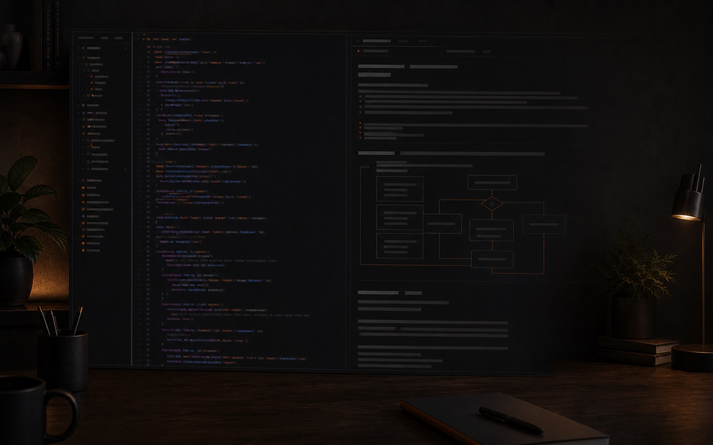
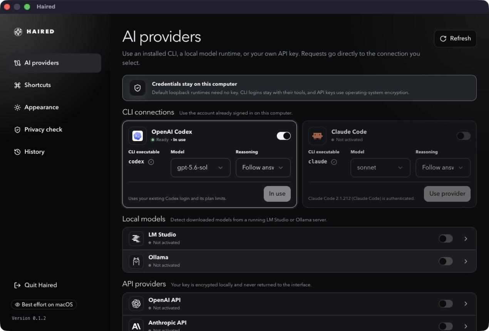
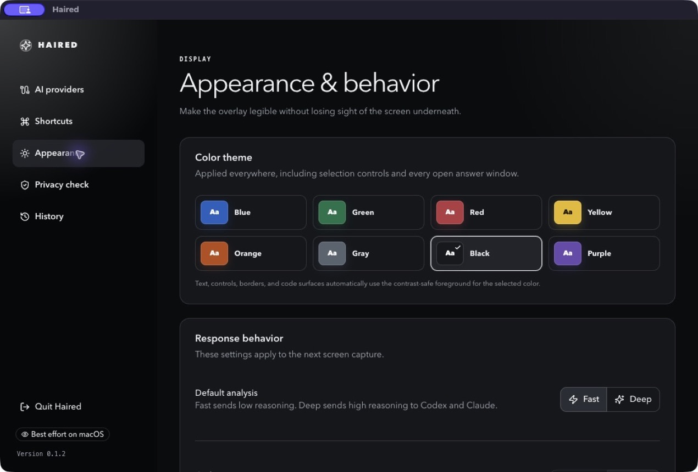
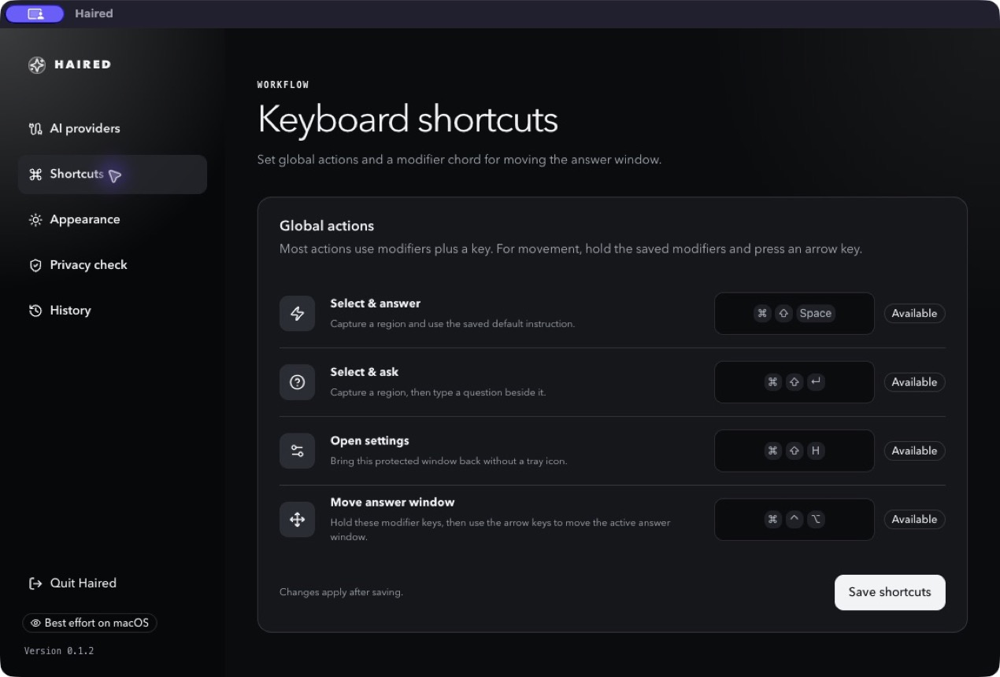
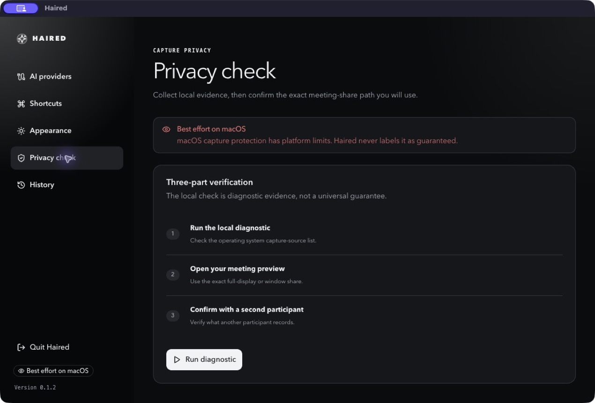

# Haired

A free, open-source **stealth pair-programming and interview AI assistant** for macOS and Windows.

<p align="center">
  
</p>

<p align="center">
  <a href="https://haired.seifelmoulouk.com/#downloads">Download</a> ·
  <a href="https://rsm23.github.io/haired/">Website</a> ·
  <a href="#features">Features</a> ·
  <a href="#providers">Providers</a>
</p>

## What is Haired?

Haired sits quietly on your desktop until you need it. Select any permitted
screen region or browser tab and get a streamed coding answer in an always-on-top overlay—no
context switching, no browser tab, no account required.

- **Stealth pair programming** — ask about code, errors, tests, or diagrams without leaving your editor.
- **Interview Mode** — structured reasoning, plan, complete code, trade-offs, edge cases, complexity, and validation.
- **Fast / Deep reasoning** — concise fixes or thorough step-by-step analysis.
- **Browser tab capture** — pair the Chrome/Edge companion extension, press a shortcut, then click a tab to answer its visible page viewport.
- **Your models, your keys** — local LM Studio / Ollama, an existing Codex or Claude CLI login, or your own provider API key.
- **Encrypted local history** — screenshots, prompts, and answers stay encrypted on your machine.
- **Screen-share aware** — on supported Windows capture paths, Haired asks the OS to exclude its windows from Microsoft Teams, Zoom, and Google Meet shares.

> [!IMPORTANT]
> Use Haired only for content you are permitted to capture and send to your
> chosen provider. Screen-share protection is platform-dependent; always verify
> the live meeting preview before sharing sensitive content.

## Features

### Capture a browser tab

The companion extension captures the visible page viewport in Chrome or Edge,
without the address bar, tab strip, or other windows. Press
`Cmd+Option+Shift+T` on macOS or `Ctrl+Alt+Shift+T` on Windows, then click your
current tab or another tab within 30 seconds. Haired uses your selected provider,
default instruction, and answer mode, including Interview Mode.

Open **Settings → Shortcuts → Open extension folder**, load that folder as an
unpacked extension, then copy the pairing code into the extension options.
See the [browser tab capture guide](docs/browser-tab-capture.md) for setup,
permissions, cancellation, and troubleshooting, or the
[extension source](apps/desktop/browser-extension/).

Tab capture is included in the current source and packages built from it. The
existing v0.1.3 release notes describe the previously published macOS packages;
see [unreleased changes](docs/releases/unreleased.md) for these additions.

### Connect your own providers

No Haired account, no hosted proxy, no usage credits. Pick the model you already have.

<p align="center">
  
</p>

### Customize the overlay

Themes, opacity, fonts, shortcuts, magnifier, and launch-at-login—tune the overlay so it fits your workflow.

<p align="center">
  
</p>

### Keyboard-first

Global shortcuts for capture, ask, settings, and moving answer windows. Record your own in the app.

<p align="center">
  
</p>

### Privacy check

See your platform's capture-protection status and run a local diagnostic before you share your screen.

<p align="center">
  
</p>

## Providers

| Kind | Providers |
|---|---|
| Local CLI (reuse existing login) | OpenAI Codex CLI, Claude Code CLI |
| Local runtime | LM Studio, Ollama |
| Bring-your-own-key | OpenAI, Anthropic, Google Gemini, Mistral, OpenAI-compatible |

API keys are encrypted with the OS secure storage (macOS Keychain / Windows DPAPI) and never returned to the renderer. Local models run on your machine; requests to BYOK providers go directly from the app to the provider.

On macOS, Haired also checks common user CLI installation folders when launched
from Finder, including `~/.vite-plus/bin`, `~/.local/bin`, `~/.npm-global/bin`,
`/opt/homebrew/bin`, and `/usr/local/bin`. A configured executable path takes
precedence. If a selected provider is unavailable, Settings labels it
**Selected**; **In use** means the selected provider is ready.

## Quick start

1. **Install Haired** from the [download page](https://haired.seifelmoulouk.com/#downloads):
   macOS v0.1.3 for Apple silicon or Intel, or Windows 10/11 x64 v0.1.2.
2. **Pick a provider** in Settings → AI providers:
   - Run `codex login` or `claude auth login` for CLI providers.
   - Start LM Studio's local server or `ollama serve` for local models.
   - Or paste an API key for OpenAI, Anthropic, Gemini, Mistral, or a compatible endpoint.
3. **Select a screen region** with `Cmd/Ctrl+Shift+Space` (answer) or `Cmd/Ctrl+Shift+Enter` (ask).
4. **Read the answer** in the overlay, copy code, ask follow-ups, or save it to encrypted history.

For tab capture with a build containing the new feature, follow the
[extension setup guide](docs/browser-tab-capture.md) and use **Select tab & answer**.

| Action | Default shortcut |
|---|---|
| Select & answer | `Cmd/Ctrl+Shift+Space` |
| Select & ask | `Cmd/Ctrl+Shift+Enter` |
| Select tab & answer | `Cmd+Option+Shift+T` / `Ctrl+Alt+Shift+T` |
| Open settings | `Cmd/Ctrl+Shift+H` |
| Move answer window | Hold `Cmd/Ctrl+Alt` + arrow keys |

> [!NOTE]
> The macOS v0.1.3 packages are signed with an Apple Developer ID certificate,
> notarized by Apple, and distributed with stapled notarization tickets. Choose
> the Apple silicon or Intel DMG on the release page and optionally verify its
> published SHA-256 checksum before installing.

## Development

Use Node.js 22.12 or newer and pnpm 11.10.0.

```sh
pnpm install --frozen-lockfile
pnpm dev
```

Run `pnpm check` for lint, TypeScript checks, tests, and builds. Use
`pnpm dev:web` for the website and `pnpm --filter @haired/desktop dist` to
build desktop installers with the production configuration. Desktop packages
bundle the companion extension as an unpacked folder; it has no separate build
step. Production publication follows the [release gates](docs/release-gates.md).

## License

MIT — see [LICENSE](LICENSE).
